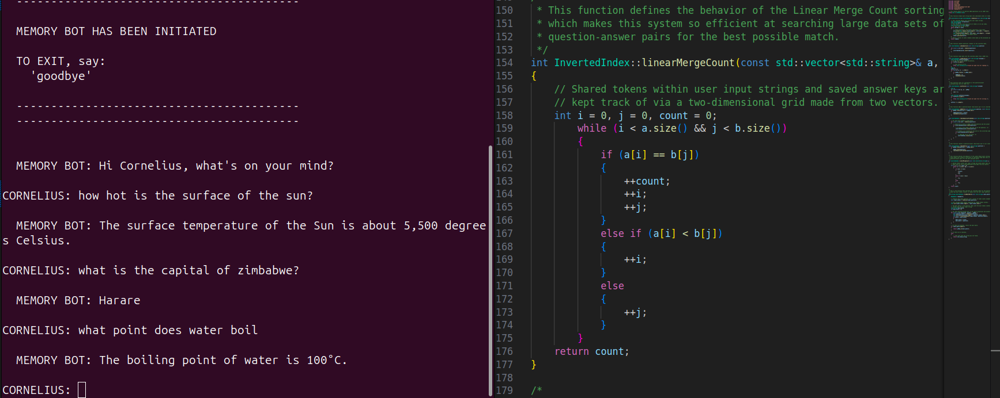
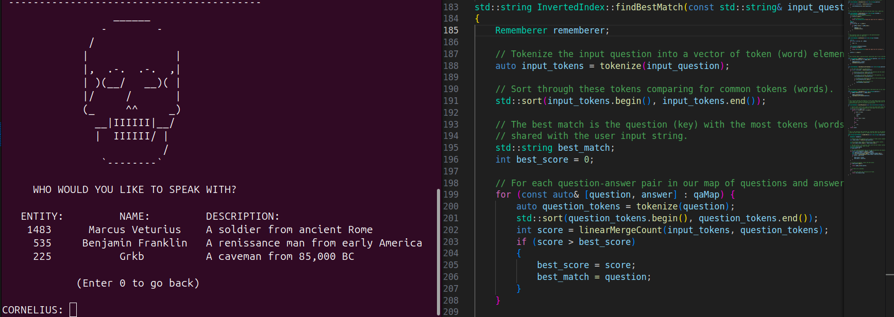

## A. Emilio DiStefano

Hi, I'm Emilio - a results-driven software engineer dedicated to the development of effective, efficient, and low-cost robotics and embedded system solutions.

# Project 1: 

## [MemoryBot](https://github.com/AEmilioDiStefano/MemoryBot)

The MemoryBot project is a system for seamless access to information (anything from the melting point of potassium to the name of your cousin Constancia's fourth daughter).  Give MemoryBot new knowledge and he will remember it for later. 

This program is written in C++ and uses an inverted index data structure along with a linear merge count algorithm to find the best answers to questions asked by the user.  The system uses a local JSON data store and does not require an internet connection to run.  Large data sets can be stored locally for each agent in order to achieve a high level of precision in answering questions.  The application is lightweight and can run on embedded systems.  The final goal of this project is to run it on an autonomous mobile robot as an energy-efficient solution for a robot capable of communicaitng with humans using locally stored data for usbability in situations where signal communication is unreliable or impossible. 

Also, simulate necromancy with the "Talk to dead people" function. 

Here is a video showcasing the functionality of the MemoryBot app:
https://www.youtube.com/watch?v=cjq_WKRvxD4

# Project 2: 

## [PlantSitter](https://github.com/AEmilioDiStefano/PlantSitter)

PlantSitter is an embedded system able to detect changes in air temperature and soil humidity to trigger the execution of processes meant to maintain an optimal growing climate in controlled agricultural environments (a smart greenhouse system).  Whether you're producing agricultural procudts or you just need a reliable system to take care of your house plants while you're on vacation, PlantSitter is your ideal solution for maintaining plant health through the triggering of climatization control processes based on sensor input.
