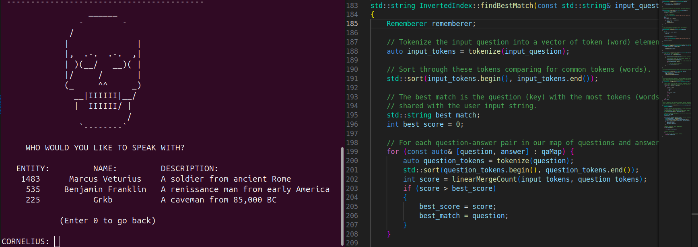

## A. Emilio DiStefano

Hi, I'm Emilio - a results-driven software engineer dedicated to the development of effective, efficient, low-cost robotics and embedded systems solutions.  Here are some of my projects: 

   
   

# Legion Control Workspace  
 

### [Legion Control Workspace](https://github.com/AEmilioDiStefano/ros2_ws) and [Legion Control Workspace Minimal](https://github.com/AEmilioDiStefano/ros2_ws_minimal)

This ROS2 workspace contains a full robotics development environment which includes robotics virtualization software and the Python version of my 100% original **robot_legion_teleop** package.  The objective of this system is to act as a **remote control module for first-person-view swarm control of autonomous mobile robots** (the minimal version omits virtualization and visualization).  **As robots work autonomously** toward mission success, **human pilots are able take control of individual robots when opportunities are caught by the human eye via remote camera mux**.  The finished product will enable users anywhere in the world with an internet connection to effectively control a remote swarm of robots.

This project’s source code is licensed under the PolyForm Noncommercial License 1.0.0, which allows personal and noncommercial use but prohibits commercial use without obtaining a separate commercial license from me or my company.

   
   

# Differential Drive Robot Build Tutorial  
 
[Robot Build Tutorial](https://github.com/AEmilioDiStefano/ros2_ws_minimal)

This minimal (headless) version of the **Legion Control Workspace** contains all of the software needed to build and control one or several robots from a remote location.  While the **Legion Control Workspace** is designed for laptops or control computers, **Legion Control Workspace Minimal** is designed to be cloned onto the robots themselves.  Included is a comprehensive tutorial complete with visual and written build instructions to turn roughly $120 USD into a simple robot ready for autonomous functions. 

This project’s source code is licensed under the PolyForm Noncommercial License 1.0.0, which allows personal and noncommercial use but prohibits commercial use without obtaining a separate commercial license from me or my company.

   
   

# FPV Router

### [FPV Router](https://github.com/AEmilioDiStefano/FPV_router)

This Pi-powered FPV router uses a single-board computer with a full Linux operating system for **ultra-customizable routing**.  Optimized for **low-latency video transfer for FPV robotics operations**, this router outperforms even high-end travel router models at a price comparable to that of a mid-range travel router.  Use this router to control robot swarms, or customize it to virtually any end that you can think of.

This project’s source code is licensed under the PolyForm Noncommercial License 1.0.0, which allows personal and noncommercial use but prohibits commercial use without obtaining a separate commercial license from me or my company.

 
 

# MemoryBot (Education) 

### [MemoryBot](https://github.com/AEmilioDiStefano/MemoryBot)

The MemoryBot project is a system for seamless access to information regardless of internet accessibility.  Tell MemoryBot anything from the melting point of potassium to the name of your fourth cousin's fifth daughter, and MemoryBot will remember it for later.  No more forgotten birthdays, no more awkwardly asking questions which you should already know the answer to, and no more depending on the internet for knowledge - accumulate your own here.  

Also, simulate necromancy with the "Talk to dead people" function.  Have you ever wanted to interview Benjamin Franklin on what he would think of the modern world?  MemoryBot's "Talk to dead people" function can make that happen.  The system is designed for the easy addition of new entities.  Just add a JSON file of question-answer (key-value) pairs and make some minor code adjustments to converse with the historical figure or fictional character of your choice.  JSON files with question-answer(key-value) pairs can be written manually or generated from an AI services like ChatGTP.  **As more questions and answers are added to each entity's JSON memory file, the entity's dialogue will become more accurate and convincing**.  Three of these such entities are included in this program for inspiration. 

This program is written in C++ and uses an **inverted index data structure** along with a **linear merge count algorithm** to find the best answers to questions asked by the user.  The system uses a local JSON data store and does not require an internet connection to run.  **Large conversational data sets can be stored locally for each agent in order to achieve a high level of precision in answering questions**.  The application is lightweight and can **run on very limited hardware**.  The final goal of this project is to run it on an autonomous mobile robot as an energy-efficient solution for communication with humans using locally stored data for usbability in **situations where signal communication is unreliable or impossible**. 

Here is a video showcasing the functionality of the [MemoryBot system](https://www.youtube.com/watch?v=cjq_WKRvxD4).

 
 
