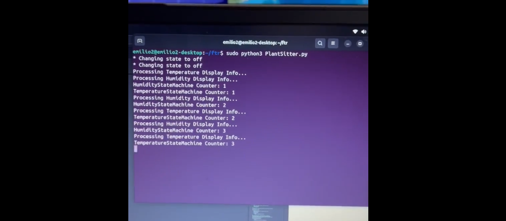

## A. Emilio DiStefano

Hi, I'm Emilio - a results-driven software engineer dedicated to the development of effective, efficient, and low-cost robotics and embedded system solutions.

# Project 1: 

## [MemoryBot](https://github.com/AEmilioDiStefano/MemoryBot)

This program is written in C++ and uses an inverted index data structure along with a linear merge count algorithm to find the best answers to questions asked by the user.  The system uses a local JSON data store and does not require an internet connection to run.  Large data sets can be stored locally for each agent in order to achieve a high level of precision in answering questions.  The application is lightweight and can run on embedded systems.  The final goal of this project is to run it on an autonomous mobile robot as an energy-efficient solution for a robot capable of communicaitng with humans using locally stored data for usbability in situations where signal communication is unreliable or impossible. 

The MemoryBot project is a system for seamless access to information regardless of internet accessibility.  Tell MemoryBot anything from the melting point of potassium to the name of your fourth cousin Constancia's fifth daughter, and MemoryBot will remember it for later.  No more forgotten birthdays, no more awkwardly asking questions which you should already know the answer to, and no more depending on the internet for answers. 

Also, simulate necromancy with the "Talk to dead people" function.  Have you ever wanted to interview Benjamin Franklin on what he would think of the modern world?  MemoryBot's "Talk to dead people" function can make that happen.  The system is designed for the easy addition of new entities.  Just add a JSON file of question-answer (key-value) pairs and make some minor code adjustments to converse with the historical figure or fictional character of your choice.  JSON files with question-answer (key-value) pairs can be made manually or generated from an AI service like ChatGTP.  As more questions and answers are added to the JSON file, the entity's dialogue will become more convincing.

Here is a video showcasing the functionality of the [MemoryBot system](https://www.youtube.com/watch?v=cjq_WKRvxD4).

And here are some screenshots of the running application:

# Project 2: 

## [PlantSitter](https://github.com/AEmilioDiStefano/PlantSitter)

PlantSitter is an embedded system able to trigger the execution of processes meant to maintain an optimal growing climate in controlled agricultural environments based on changes in air temperature and humidity levels (a smart greenhouse system).  Whether you're producing agricultural procudts or you just need a reliable system to take care of your house plants while you're on vacation, PlantSitter is your ideal solution for maintaining plant health through the triggering of climatization control processes based on sensor input.

PlantSitter can also be used for the DIY curing of preserved meats such as Cappicola and Serrano ham.  Just put the circuit and the heating/cooling/humidifying/drying in a closed environment with dimensions apropriate for the strength of your heating/cooling/humidifying/drying components.

Here is a video showcasing the [PlantSitter application running on the custom circuit](https://www.youtube.com/shorts/BfkOsw1nlx0) 
.

And here are some screenshots of the running application:

# Code Review
Here is a link to [my code review of the original artifacts](https://www.youtube.com/watch?v=FD-Vz5hAikA).

Here is a link to [the original MemorytBot artifact being reviewed before it was updated](https://github.com/AEmilioDiStefano/memory-bot-python). 

Here is a link to [the original PlantSitter artifact being reviewed before it was updated](https://github.com/AEmilioDiStefano/embedded-systems).

# Narratives 
Here is a link to [all of my reflections and narratives throughout the Computer Science Capstone project course](https://github.com/AEmilioDiStefano/capstone-project).
